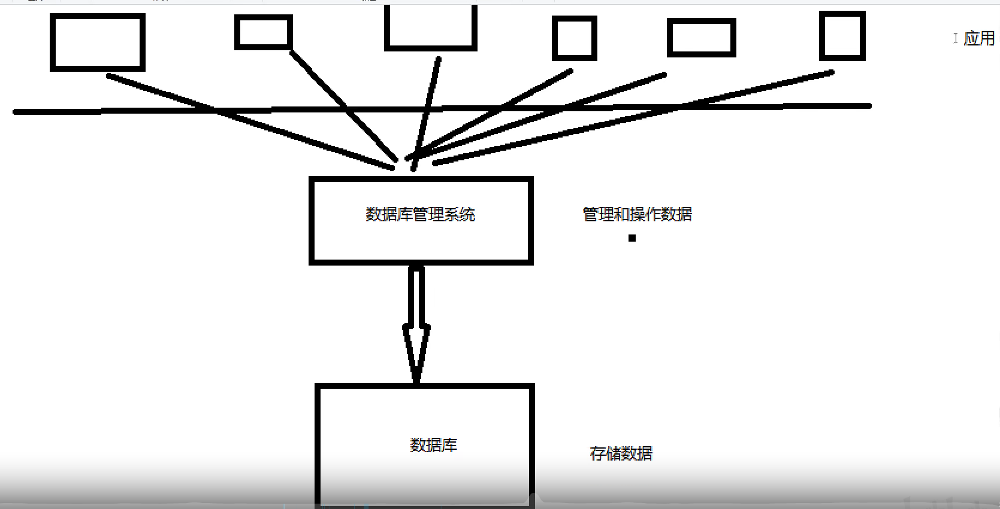
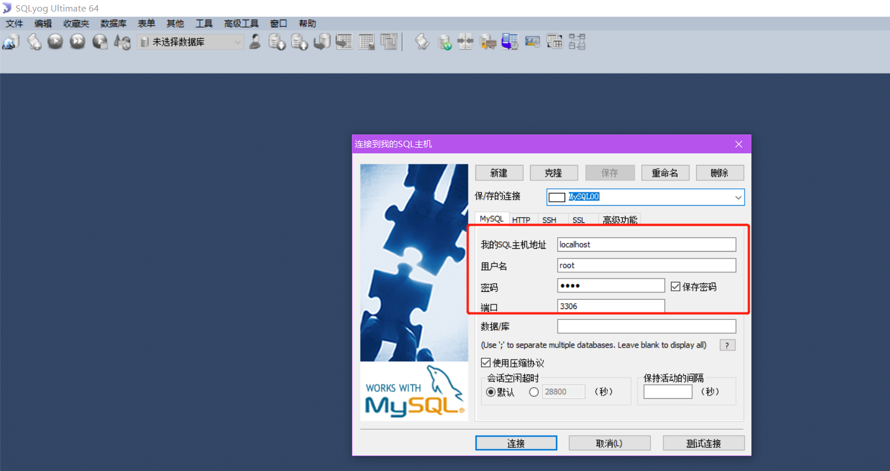
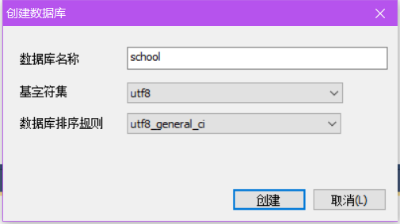
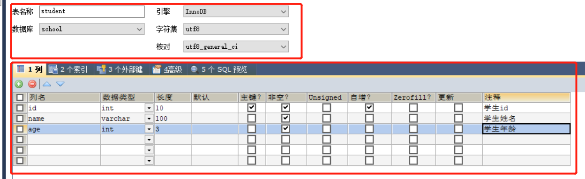
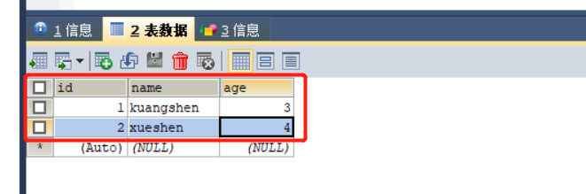

# 1、初识MySQL
前端：用于页面数据的展示；<br>
后端：连接数据库(JDBC)，连接前端(控制视图跳转和向前端传递数据)。
数据库(存数据，TXT, Excel, word)

## 1.1、为什么要学习数据库
1、岗位需求；<br>
2、大数据时代，得数据库者得天下；<br>
3、被迫需求：存数据；<br>
4、<font color='red'>数据库是所有软件体系中最核心的存在。</font>DBA

## 1.2、什么是数据库
数据库(DB, DataBase)<br>
概念：数据仓库，安装在操作系统(Linux, mac, Windows,...)之上的软件！SQL, 可以存储大量的数据，500万<br>
作用：存储数据，管理数据。

## 1.3、数据库分类
关系型数据库：(SQL)
- MySQL, Oracle, Sql Server, DB2, SQLite
- 通过表和表之间，行和列之间的关系进行数据的存储。如学员表，考勤表，...
  
非关系型数据库：(NoSQL) Not Only
- Redis, MongDB
- 非关系型数据库，对象存储，通过对象的自身属性来决定。

<font color='red'>DBMAS(数据库管理系统)</font>

- 数据库的管理软件，科学有效的管理我们的数据。一般用来维护和获取数据；
- MySQL，数据库管理系统！
- 


## 1.4、MySQL简介
MySQL是一个<b>关系型数据库管理系统</b>
前世：瑞典MySQL AB公司

今生：属于Oracle旗下产品

MySQL是最好的RDBMS(Relational Database Management System, 关系型数据库管理系统)应用软件之一。

是开源的数据库软件。
体积小，速度快，总体拥有成本低，招人成本低，所有人必须会~
中小型网站或大型网站应用，还可以集群。

官网：https://www.mysql.com/<br>
官网下载：https://dev.mysql.com/downloads/mysql/

安装建议：

1、尽量不要使用exe，因为安装时会往注册表写入，卸载麻烦；<br>
2、尽量使用压缩包安装。<br>

## 1.5、安装MySQL

参考百度。

## 1.6、安装SQLyog
1、无脑安装；<br>
2、注册；<br>
3、打开连接数据库；<br>



4、新建一个数据库school；<br>



<font color='red'>每一个SQLyog的执行操作都对应一个sql，可以在软件的历史记录中查看。</font>

5、新建一个表stdent；<br>
> 字段：id, name, age.
> 



6、查看表

7、自己添加多条记录，刷新保存



## 1.7、连接数据库
```sql
 -- 连接数据库
mysql -uroot -p123456  
-- 修改用户密码
update mysql.user authentication_string=password('123456') where user='root' and Host='localhost';
-- 刷新权限
flush privileges;

-------------------------------------------------------
----所有的语句都使用;结尾，否则会被认为没写完整

--查看所有的数据库
show database;

-- 切换数据库名  use数据库名
> use school;
Database changed

-- 查看数据库的所有表
show tables;
-- 显示数据库中某个表的信息
describe student;

-- 创建一个数据库
create database wetos;

-- 退出连接
exit;

--关于注释
--单行注释：--
--多行注释：
/*
gyuguy*/
```

<b>数据库XXX语言</b>    CRUD 增删改查！

CRUD: Create, Release, Update, Delete

DDL     定义

DML     管理

DQL     查询

DCL     控制
