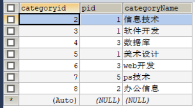

# 4、DQL查询数据(最重点)

# 4.1、DQL
(Data Query Language:数据库查询语言)
- 所有的查询操作都用它 Select
- 简单的查询，复杂的查询它都能做~
- <font color='red'>数据库中最核心的语言，最重要的语句</font>
- 使用频率最高的语句

> select 语法
```sql
SELECT [ALL | DISTINCT]
{*|table.*| [table.field1[as alias1][,table.field1[as alias2][......]]}
FROM table_name [as table_alias]
    [left | right | inner join table_name2] -- 联合查询
    [WHERE ...] -- 指定结果需要满足的条件
    [GROUP BY ...] -- 指定结果按照哪几个字段来分组
    [HAVING] -- 过滤分组的记录必须满足的次要条件
    [ORDER BY ...] -- 指定查询记录按一个或多个条件排序
    [LIMIT {[offset,]row_count | row_countOFFSET offset}];
    -- 指定查询记录从哪条到哪条
```
<b>注意：[]括号代表可选的，{}代表必选的</b>

# 4.2、指定查询字段
```sql
-- 查询全部的学生 SELECT 字段 FROM 表
SELECT * FROM `student`;

-- 查询指定字段
SELECT `studentno`, `studentname` FROM `student`;

-- 别名，给结果起一个名字 AS 可以给字段起别名，也可以给表起别名
SELECT `studentno` AS 学号, `studentname` AS 学生姓名 FROM `student`;

-- 函数 concat(a, b) 字符串的拼接
SELECT CONCAT('新名字：', `studentname`) AS 新名字 FROM `student`;
```
语法：`SELECT 字段名1[AS 别名1],字段名2[AS 别名2],.., FROM 表 AS 别名`
> 有时候字段名不是很见名知意，可以对它使用别名

> 去重 distinct

作用：去除`SELECT`语句查询结果中重复的数据，只显示一条。
```sql
-- 从成绩表中查询一下哪些同学参加了考试
SELECT * FROM `result`; -- 查询全部的考试成绩
SELECT DISTINCT `studentno` FROM `result`; -- 发现重复的数据，去重
```
> 数据库中的列(表达式)
```sql
SELECT VERSION(); -- 查询系统的版本号(函数)
SELECT 100*3-1 AS 计算结果; -- 用来计算(表达式)
SELECT @@auto_increment_increment; -- 查询自增的步长(变量)

-- 学生的考试成绩 +1分查看
SELECT `studentno`, `studentresult`+1 AS 提分后 FROM `result`;
```
<font color='red'>数据库中的表达式：文本值，列，NULL，函数，计算表达式，系统变量...</font>

语法：`SELECT 表达式 FROM 表`

# 4.3、where条件子句
作用：检索数据中`符合条件`的值。

搜索的条件由一个或多个表达式组成！ 结果 布尔值

> 逻辑运算符
 
| 运算符 | 语法 | 描述 |
| ---- | ---- |---- |
| and && | a and b | 逻辑与 |
| or \|\| | a or b | 逻辑或 |
| Not ! | not a | 逻辑非 |

<font color='red'>尽量使用`英文字母`。</font>
```sql
-- ========================== where =========================
SELECT `studentno`, `studentresult` FROM `result`;

-- 查询考试成绩在 95-100 分之间
SELECT `studentno`, `studentresult` FROM `result` 
WHERE `studentresult` >= 95 AND `studentresult` <= 100;

-- and  &&
SELECT `studentno`, `studentresult` FROM `result`
WHERE `studentresult` >= 95 && `studentresult` <= 100;

-- 模糊查询（区间范围）
SELECT `studentno`, `studentresult` FROM `result` 
WHERE `studentresult` BETWEEN 95 AND 100;

-- 除了1000号学生之外的同学的成绩
SELECT `studentno`, `studentresult` FROM `result`
WHERE `studentno` != 1000;

-- != NOT
SELECT `studentno`, `studentresult` FROM `result`
WHERE NOT `studentno` = 1000;
```

> 模糊查询：比较运算符

| 运算符 | 语法 | 描述 |
| ---- | ---- |---- |
| IS NULL && | a IS NULL | 如果操作符为NULL，结果为真 |
| IS NOT NULL | a IS NOT NULL | 如果操作符为NULL，结果为假 |
| BETWEEN | a BETWEEN b AND c | 如果a在[b,c]之间，结果为真 |
|<b> Like </b> |a like b| SQL匹配，若a匹配b，则结果为真 |
|<b> In </b> |a in(a1, a2, a3...)| 如若a在(a1, a2, a3,..)中，则结果为真 |

```sql
-- ========================== 模糊查询 =========================
-- like结合 %(代表0到任意个字符) _(只有一个字符)
-- 查询姓张的同学
SELECT `studentno`, `studentname` FROM `student`
WHERE `studentname` LIKE '张%';

-- 查询姓张的同学，名字后面只有一个字符
SELECT `studentno`, `studentname` FROM `student`
WHERE `studentname` LIKE '张_';

-- 查询姓张的同学，名字后面有两个字符
SELECT `studentno`, `studentname` FROM `student`
WHERE `studentname` LIKE '张__';

-- 查询名字中间有'嘉'字的同学 %嘉%
SELECT `studentno`, `studentname` FROM `student`
WHERE `studentname` LIKE '%嘉%';

-- ====== in (具体的一个或多个值) =======
-- 查询1001,1002,1003号学员
SELECT `studentno`, `studentname` FROM `student`
WHERE `studentno` IN (1001, 1002, 1003);

-- 查询在北京的学生
SELECT `studentno`, `studentname` FROM `student`
WHERE `address` IN ('北京朝阳');

-- ====== null 和 not null =======
-- 查询地址为空的学生 null 或 ''
SELECT `studentno`, `studentname` FROM `student`
WHERE `address`='' OR `address` IS NULL;

-- 查询有出生日期的同学 不为空
SELECT `studentno`, `studentname` FROM `student`
WHERE `borndate` IS NOT NULL;
```

# 4.4、联表查询
> JOIN 对比


```sql
-- ========================== 联表查询 join =========================

-- 查询参加了考试的同学(学号，姓名，科目编号，分数)
/* 思路
1、分析需求，分析查询的字段来自哪些表。 （连接查询）
2、确定使用哪种连接查询。 （有7种连接查询）
确定交叉点(这两个表中哪个数据是相同的)
判断的条件：学生表中的studentNo = 成绩表 studentNo
*/

-- join (连接的表) on (判断的条件) 连接查询
-- where 等值查询

-- inner join: 查询交叉部分
SELECT s.`studentno`, `studentname`, `subjectno`, `studentresult`
FROM `student` AS s
INNER JOIN `result` AS r
ON s.`studentno` = r.`studentno`;

-- right join: 以右表为基准
SELECT s.`studentno`, `studentname`, `subjectno`, `studentresult`
FROM `student` AS s
RIGHT JOIN `result` AS r
ON s.`studentno`=r.`studentno`

-- left join: 以左表为基准
SELECT s.`studentno`, `studentname`, `subjectno`, `studentresult`
FROM `student` AS s
LEFT JOIN `result` AS r
ON s.`studentno`=r.`studentno`
```
| 操作 | 描述 |
| ---- | ---- |
| inner join | 如果表中至少有一个匹配，就返回行，两个表都有的字段需要指定具体表的行 |
| left join | 会从左表中返回所有的值，即使右表中没有匹配，即以左表为基准 |
| right join | 会从右表中返回所有的值，即使左表中没有匹配。即以右表为基准 |

```sql
-- ========================== 联表查询 join =========================

-- 查询参加了考试的同学(学号，姓名，科目编号，分数)
/* 思路
1、分析需求，分析查询的字段来自哪些表。 （连接查询）
2、确定使用哪种连接查询。 （有7种连接查询）
确定交叉点(这两个表中哪个数据是相同的)
判断的条件：学生表中的studentNo = 成绩表 studentNo
*/

-- join (连接的表) on (判断的条件) 连接查询
-- where 等值查询

-- inner join: 查询交叉部分
SELECT s.`studentno`, `studentname`, `subjectno`, `studentresult`
FROM `student` AS s
INNER JOIN `result` AS r
ON s.`studentno` = r.`studentno`;

-- right join: 以右表为基准
SELECT s.`studentno`, `studentname`, `subjectno`, `studentresult`
FROM `student` AS s
RIGHT JOIN `result` AS r
ON s.`studentno`=r.`studentno`

-- left join: 以左表为基准
SELECT s.`studentno`, `studentname`, `subjectno`, `studentresult`
FROM `student` AS s
LEFT JOIN `result` AS r
ON s.`studentno`=r.`studentno`

-- 查询缺考的同学
SELECT s.`studentno`, `studentname`, `subjectno`, `studentresult`
FROM `student` AS s
LEFT JOIN `result` AS r
ON s.`studentno`=r.`studentno`
WHERE `studentresult` IS NULL;

-- 思考题(查询参加考试同学的信息：学号，学生姓名，科目名称，分数)
/* 思路
1、分析需求，分析查询的字段来自哪些表。 sudent、result、subject（连接查询）
2、确定使用哪种连接查询。 （有7种连接查询）
确定交叉点(这两个表中哪个数据是相同的)
判断的条件：学生表中的studentNo = 成绩表 studentNo
*/
SELECT s.`studentno`, `studentname`, `subjectname`, `studentresult`
FROM `student` AS s
RIGHT JOIN `result` AS r
ON s.`studentno`=r.`studentno`
INNER JOIN `subject` AS sub
ON r.`subjectno`=sub.`subjectno`;

-- 我要查询哪些数据 select ...
-- 从那几个表中查 FROM 表 XXX Join 连接的表 ON 交叉条件
-- 假设存在一种多张表查询，慢慢来，先查询两张表然后慢慢增加

-- FROM a LEFT JOIN b	以左边的表为基准
-- FROM A RIGHT JOIN b  以右边的表为基准
```

> 自连接(了解)

自己的表和自己的表的连接。核心：<b><font color='red'>一张表拆为两张一样的表即可</font></b>

建表如下。



根据`pid=1`可得父类如下。
| category | categoryName |
| ---- | ---- |
| 2 | 信息技术 |
| 3 | 软件开发 |
| 5 | 美术设计 |

子类
| pid | categoryid | categoryName |
| ---- | ---- | ---- |
| 3 | 4 | 数据库 |
| 3 | 6 | web开发 |
| 5 | 7 | ps技术 |
| 2 | 8 | 办公信息 |

操作：查询表中父类对应子类的关系。
```sql
-- 查询父子信息：把一张表看为两个一模一样的表
SELECT a.`categoryName` AS '父栏目', b.`categoryName` AS '子栏目'
FROM `category` AS a, `category` AS b
WHERE a.`categoryid`=b.`pid`;
```

## 练习题目
```sql
-- 查询学员所属的年级 (学号，学生的姓名，年级的名称)
SELECT `studentno`, `studentname`, `gradename`
FROM `student` AS s
LEFT JOIN `grade` AS g
ON s.`gradeid`=g.`gradeid`;

-- 查询科目所属的年级 (科目名称，年级名称)
SELECT `subjectname`, `gradename` 
FROM `subject` AS sub
INNER JOIN `grade` AS g
ON sub.`gradeid`=g.`gradeid`;

-- 查询了参加 数据库结构-1 考试的同学信息 (学号，学生姓名，科目名，分数)
SELECT s.`studentno`, `studentname`, `subjectname`, `studentresult`
FROM `student` AS s
INNER JOIN `result` AS r
ON s.`studentno`=r.`studentno`
INNER JOIN `subject` AS sub
ON r.`subjectno`=sub.`subjectno`
WHERE `subjectname` LIKE '数据库结构-1';


-- 查询考试成绩>70的 学生id 学生名字 年级名称 科目名称 考试成绩
SELECT s.`studentno`, `studentname`, `gradename`, `subjectname`, `studentresult`
FROM `student` AS s
RIGHT JOIN `result` AS r
ON s.`studentno`=r.`studentno`
INNER JOIN `grade` AS g
ON s.`gradeid`=g.`gradeid`
INNER JOIN `subject` AS sub
ON r.`subjectno`=sub.`subjectno`
WHERE `studentresult`>70;
```


