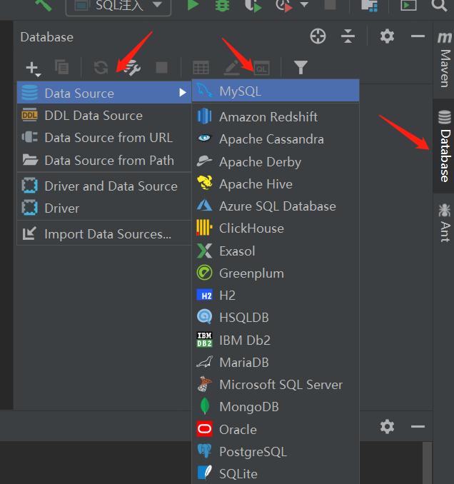
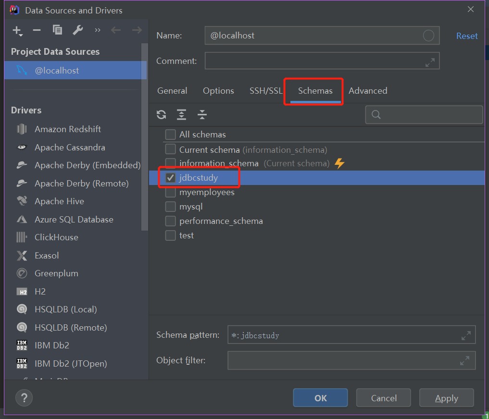
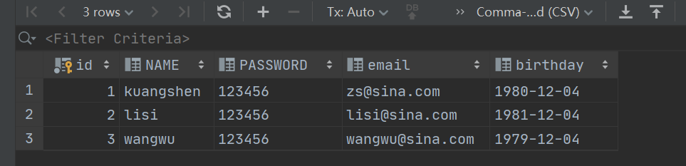
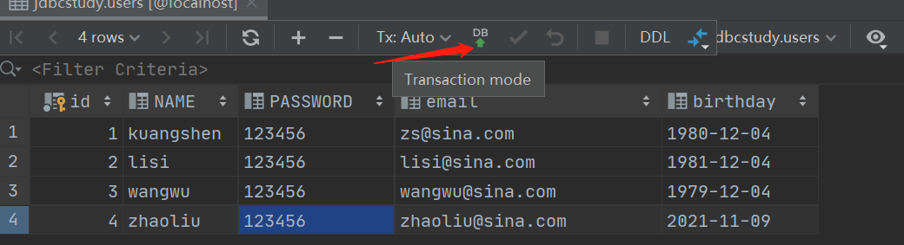
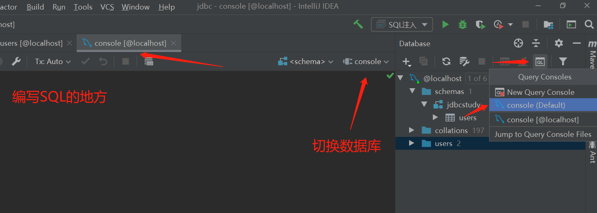

# 10.7、使用IDEA连接数据库




连接成功后，可以选择数据库。



双击数据库。





更新数据




打开SQL控制台，编写SQL语句




# 10.8、事务

<font color='red'>要么都成功，要么都失败</font>

> ACID原则

原子性：要么都执行完成，要么都不完成；

一致性：执行后数量总量不变；

持久性：事务一旦提交，数据就会被持久化到数据库；

<b>隔离性：多个事务之间不会相互干扰。</b>

隔离性的问题：

脏读：一个事务读取另一个没有提交的事务

不可重复读：在同一个事务内，当表的数据发生改变后，重复读取表的数据

虚读（幻读）：在一个事务内，读取了别人插入的数据，导致前后读取的结果不一致


> 代码实现

1、开启事务；<b>connection.setAutoCommit(false);</b>

2、一组业务执行完毕，提交事务；

3、可以在catch语句中显示定义，执行失败就会回滚。

```java
package com.kuang.lesson04;

import com.kuang.lesson02.utils.JdbcUtils;

import java.sql.Connection;
import java.sql.PreparedStatement;
import java.sql.ResultSet;
import java.sql.SQLException;

public class TestTransaction1 {

    public static void main(String[] args) {
        Connection connection = null;
        PreparedStatement statement = null;
        ResultSet resultSet = null;

        try {
            connection = JdbcUtils.getConnection();
            // 关闭数据库的自动提交功能，相当于自动开启事务
            connection.setAutoCommit(false);
            // 需求：A减少100
            String sql1 = "update `account` set money=money-100 where NAME = 'A'";
            statement = connection.prepareStatement(sql1);
            statement.executeUpdate();

            // 如果没有事务，报错会导致钱变少了
//            int x = 1 / 0;
            // B增加100
            String sql2 = "update `account` set money=money+100 where NAME = 'B'";
            statement = connection.prepareStatement(sql2);
            statement.executeUpdate();

            // 业务完毕，提交事务
            connection.commit();
            System.out.println("成功！");
        } catch (SQLException e) {
            // 如果失败则回滚事务
            try {
                connection.rollback();
            } catch (SQLException e1) {
                e1.printStackTrace();
            }

            e.printStackTrace();
        } finally {
            try {
                JdbcUtils.release(connection, statement, resultSet);
            } catch (SQLException e) {
                e.printStackTrace();
            }
        }

    }
}

```


# 10.9、数据库连接池

数据库连接 --- 执行完毕 --- 释放

连接 --- 释放 十分浪费资源

<b>池化技术：预先准备一些数据库的资源，有SQL请求过来则连接这些预先准备好的资源。</b>

不采用连接池的做法如下：

对于银行，每次有新的业务的到来，处理方式为<b> ------开门--- 业务员处理 --- 关门</b>

采用连接池后，相当于有预留一定数量的业务员在银行内，处理业务的方式为 <b> ------开门--- 业务员1处理，业务员2处理，，， ------其他业务员等待 --- 直到整个服务关闭才关门</b>

对于整个业务，有以下概念：
- 常用连接数（常用业务员数）：10
- 最小连接数（处理业务最少多少个业务员）：10
- 最大连接数：15 业务最高承载上限
- 排队等待：当前无可连接资源 
- 等待超时：100ms，超过等待时间返回超时

编写连接池，实现一个接口 DataSource

> 开源数据源实现（拿来即用）
DBCP

C3P0

Druid：阿里巴巴

使用了上述数据库连接池之后，在项目开发中就不需要编写连接数据库的代码。

> DBCP
需要用的jar包
commons-dbcp2-2.9.0、commons-pool2-2.11.1

> C3P0
需要用的jar包

> 结论
无论使用什么数据源，本质还是一样，DataSource接口不变，方法就不会变

本节参考[数据库学习笔记二十三 —— 数据库连接池（DBCP、C3P0）](https://blog.csdn.net/qq_43594119/article/details/106064195)